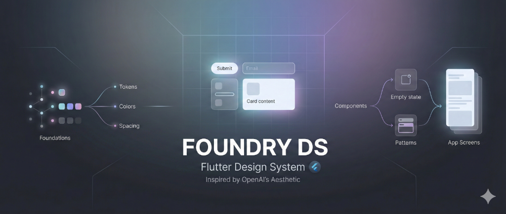
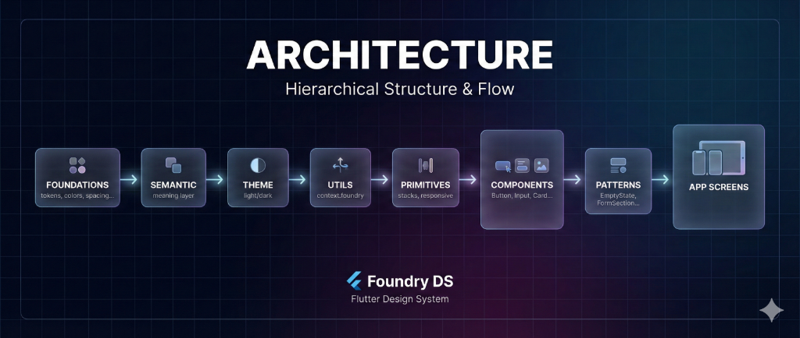

# Foundry DS

[](https://pub.dev/packages/foundry_ds)
[](LICENSE)
[](https://openai.com)



A comprehensive, production-grade Flutter design system inspired by OpenAI's aesthetic.

## Features

- 🎨 **Design Tokens**: Standardized colors, spacing, typography, and radius.
- 🧱 **Primitives**: Layout abstractions like `FoundryVStack`, `FoundryHStack`, and `FoundryGap`.
- 🧩 **Components**: Production-ready buttons, inputs, cards, and more.
- 📱 **Responsive**: Built-in responsiveness logic with `FoundryResponsive`.
- 🌗 **Theming**: First-class support for light and dark modes.
- ♿ **Accessible**: Semantic colors and typography.

## Table of Contents

- [Features](#features)
- [Architecture](#architecture)
- [Installation](#installation)
- [Quick Start](#quick-start)
- [Usage](#usage)
  - [Context Extension](#context-extension-recommended)
  - [Components](#components)
  - [Primitives](#primitives)
  - [Patterns](#patterns)
  - [Spacing & Layout](#spacing--layout)
  - [Tokens](#tokens)
- [License](#license)

## Architecture



## Installation

```yaml
dependencies:
  foundry_ds:
    path: ../foundry_ds  # or your path
```

## Quick Start

Wrap your app with `FoundryTheme`:

```dart
import 'package:foundry_ds/foundry_ds.dart';

void main() {
  runApp(
    FoundryTheme(
      data: FoundryLightTheme(),
      child: const MyApp(),
    ),
  );
}
```

## Usage

### Context Extension (Recommended)

```dart
// Clean access to theme data
final colors = context.foundry.colors;
final spacing = context.foundry.spacing;

// Or use shorthand
final colors = context.foundryColors;
```

### Components

```dart
// Button
FoundryButton(
  onPressed: () {},
  label: 'Submit',
  variant: FoundryButtonVariant.primary,
)

// Text with enforced typography
FoundryText.heading('Welcome')
FoundryText.body('Lorem ipsum...', color: colors.fg.secondary)

// Icon with enforced sizing
FoundryIcon.lg(Icons.star, color: colors.fg.accent)

// Input
FoundryInput(
  label: 'Email',
  placeholder: 'Enter your email',
)

// Card
FoundryCard(
  variant: FoundryCardVariant.elevated,
  child: FoundryText.body('Card content'),
)

// Surface (base container)
FoundrySurface.raised(
  child: FoundryText.body('Surface content'),
)

// Divider
FoundryDivider.horizontal()
```

### Primitives

```dart
// Vertical stack with automatic spacing
FoundryVStack.md(
  children: [
    FoundryText.heading('Title'),
    FoundryText.body('Description'),
    FoundryButton(onPressed: () {}, label: 'Action'),
  ],
)

// Horizontal stack with automatic spacing
FoundryHStack.sm(
  children: [
    FoundryIcon.md(Icons.star),
    FoundryText.body('Rating'),
  ],
)

// Responsive layouts
FoundryResponsive(
  builder: (context, breakpoint) {
    if (breakpoint == FoundryBreakpoint.sm) {
      return MobileLayout();
    }
    return DesktopLayout();
  },
)

// Or simpler
FoundryResponsiveChild(
  mobile: MobileView(),
  tablet: TabletView(),
  desktop: DesktopView(),
)
```

### Patterns

```dart
// Empty state
FoundryEmptyState(
  icon: Icons.inbox,
  title: 'No messages',
  description: 'Your inbox is empty',
  action: FoundryButton(onPressed: () {}, label: 'Refresh'),
)

// Form section
FoundryFormSection(
  title: 'Personal Information',
  description: 'Enter your details below',
  children: [
    FoundryInput(label: 'Name'),
    FoundryInput(label: 'Email'),
  ],
)
```

### Spacing & Layout

```dart
// Gap (recommended over SizedBox)
FoundryGap.md()  // 16px gap

// Insets (recommended over EdgeInsets)
Padding(padding: FInsets.md)  // 16px all sides
Padding(padding: FInsets.hLg) // 24px horizontal

// Page wrapper with max-width constraint
FoundryPage(
  body: YourContent(),
)
```

### Tokens

```dart
// Spacing: xxs(2), xs(4), sm(8), md(16), lg(24), xl(32), xxl(48), xxxl(64)
FSpacing.md  // 16.0

// Icon sizes: xs(12), sm(16), md(20), lg(24), xl(32), xxl(48)
FIconSize.lg // 24.0

// Border widths: none(0), hairline(1), thin(1.5), medium(2), thick(3)
FBorderWidth.medium // 2.0

// Radius: none(0), xs(2), sm(4), md(8), lg(12), xl(16), full(9999)
FRadius.lg // 12.0

// Breakpoints: sm(640), md(768), lg(1024), xl(1280), xxl(1536)
FLayout.lg // 1024.0
```

## License

MIT
